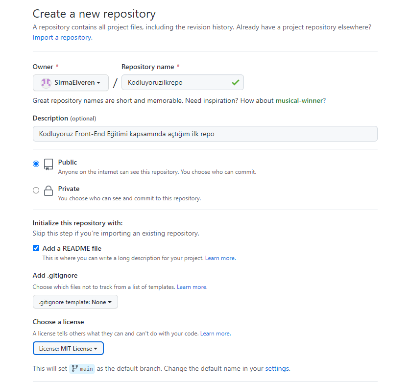

# Kodluyoruz Ilk Repo

Bu repo [Kodluyoruz](https://kodluyoruz.org) Front-End Eğitiminde oluşturduğumuz ilk repo. İçerisinde bir adet README dosyası, bir adet index.html barındırıyor.


## Installation
---------------------------------
Öncelikle projeyi clonelayın.(Buraya sizin reponuzdan link gelecek)

```github
git clone (https://github.com/SirmaElveren/Kodluyoruzilkrepo.git)
```

## Usage
----------------------------------------
Projeyi cloneladıktan sonra Visual Studio Code programında açınız.

Linux için;

```code
cd kodluyoruzilkrepo
code
```

## Contributing
-----------------------------------------
Pull requestler kabul edilir. Büyük değişiklikler için lütfen önce neyi değiştirmek istediğinizi tartışmak iin bir konu açınız.

## License
-----------------------------------------

[MIT](https://choosealicense.com/)
 